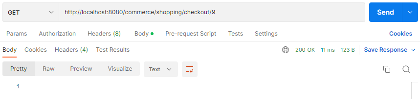

# Fibabank-Bootcamp-Project
Fibabank Bootcamp Microservice Project

## Not: Mikroservisleri tek tek deneyebilmeniz için Inventory ve Shopping mikroservislerine Client eklenmiştir.

# Postgre SQL kullanılarak iki farklı database oluşturulmuştur.

 
 

# Inventory'nin içinde bulunan tabloların içeriği.

 
 

# Get /commerce/inventory/categories için sonuçlar

 
 

# Get /commerce/inventory/products/{categoryId} için sonuçlar

 
 

# Get /commerce/inventory/product/{productId} için sonuçlar

 
 

# Get /commerce/shopping/cart/create?customerName=Name için sonuçlar

 
 

# Post /commerce/shopping/cart/add (RequestBody alıyor) için sonuçlar

 
 

# Get /commerce/shopping/cart/find/{cartId} için sonuçlar (Ekleme işleminden sonra)

 

# Delete /commerce/shopping/cart/{cartId}/remove/{productId} için sonuçlar

 

# Get /commerce/shopping/cart/find/{cartId} için sonuçlar (Silme işleminden sonra)

 

# Get /commerce/shopping/checkout/{cartId} için sonuçlar

 
 

